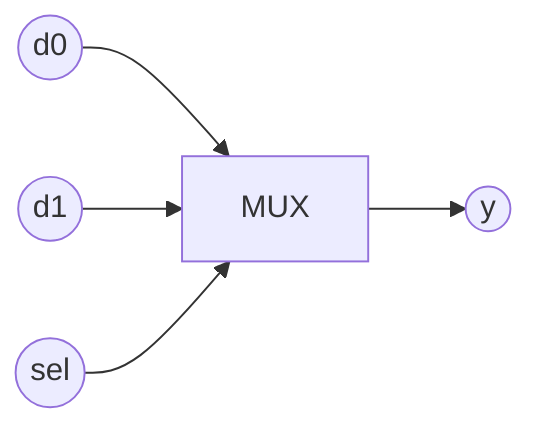

# 01.3 — Combinational MUX Design and Simulation (ModelSim)

1. Overview

Implement and simulate 2:1 and 4:1 multiplexers in ModelSim and explain their behavior.

2. Features

- `mux2_1` and `mux4_1` combinational RTL.
- Exhaustive simulation of input/select combinations.
- Simple, portable testbench structure.

3. Block Diagram

4. Directory Structure

- `rtl/`: `mux2_1.sv`, `mux4_1.sv` (if split) or single file.
- `sim/`: Testbench and wave scripts.

5. Module Descriptions

- `mux2_1(a,b,sel,y)`: 2:1 selector.
- `mux4_1(d0..d3,s1,s0,y)`: 4:1 selector by 2‑bit `s`.

6. Interface Specification

- `mux2_1`
  - `input  logic a,b,sel`
  - `output logic y` — `y = sel ? b : a`
- `mux4_1`
  - `input  logic d0,d1,d2,d3,s1,s0`
  - `output logic y` — selects one of `d0..d3` by `{s1,s0}`

7. Timing Diagrams

- Combinational propagation only; output updates immediately after inputs change.

8. Finite State Machine (FSM) Description

- Not applicable (purely combinational).

9. Parameterization

- Optional: parameterize data width `W` for vector MUXes.

10. Reset Behavior

- Not applicable; no state.

11. Clocking Requirements

- None.

12. Build / Simulation Instructions

- ModelSim/Questa: compile RTL + TB, run `run -all`, save waveform.
- Quartus+ModelSim: add files to project, simulate.

13. Testbench Architecture

- Stimulus: iterate all input/select combinations.
- Checks: expected `y` vs. reference function.

14. Verification Plan

- Cover all 8 combos (2:1) and 64 combos (4:1 with inputs varied).

15. Synthesis Notes

- Synthesizes to LUTs; ensure `case` is full or has `default`.

16. Known Issues / Limitations

- None beyond I/O polarity in specific boards.

17. License

- MIT.

18. Acknowledgments

- Course materials for EEP 535.

