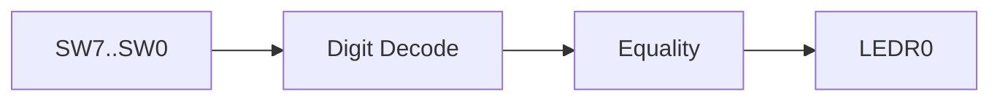

# 02.1 — Two‑Digit Equality Checker — Combinational RTL on DE1‑SoC

1. Overview

Compare two BCD digits from switches; light `LEDR[0]` when both digits match a chosen two‑digit value.

2. Features

- Pure combinational equality checking of two BCD digits.
- Top‑level `DE1_SoC` driving LEDs and HEX displays (optional).
- Simulation testbench iterating input combinations.

3. Block Diagram

4. Directory Structure

- `DE1_SoC.sv`: Top‑level mapping board I/O.
- `rtl/`: Optional equality helper(s).
- `sim/`: Testbench sweeping inputs.

5. Module Descriptions

- `DE1_SoC`: Routes `SW[7:0]` into equality logic; drives `LEDR[0]`.
- `eq2digit` (optional): Returns 1 when `{hi,lo}` equals selected digits.

6. Interface Specification

- `DE1_SoC(HEX[5:0], LEDR[9:0], KEY[3:0], SW[9:0])`
  - Inputs: `SW[3:0]=low digit`, `SW[7:4]=high digit`
  - Output: `LEDR[0]=1` on match

7. Timing Diagrams

- Combinational: `LEDR[0]` follows decoded equality without cycles.

8. Finite State Machine (FSM) Description

- Not applicable.

9. Parameterization

- Parameterize target digits if desired, e.g., `parameter H=8, L=3`.

10. Reset Behavior

- Not applicable; default HEX cleared via continuous assigns.

11. Clocking Requirements

- None.

12. Build / Simulation Instructions

- ModelSim/Questa: run the provided `DE1_SoC_testbench`.
- Quartus: compile and program DE1‑SoC; test via switches.

13. Testbench Architecture

- Stimulus: loop `i=0..255` assigning `SW[7:0]=i` with delays.
- Expected: `LEDR[0]=1` only for the chosen digits.

14. Verification Plan

- Cover all 256 combinations; spot‑check on hardware.

15. Synthesis Notes

- Keep RTL high‑level; fitter optimizes comparisons.

16. Known Issues / Limitations

- Inputs outside valid BCD still evaluated (don’t‑care for grading).

17. License

- MIT.

18. Acknowledgments

- Course materials for EEP 535.

