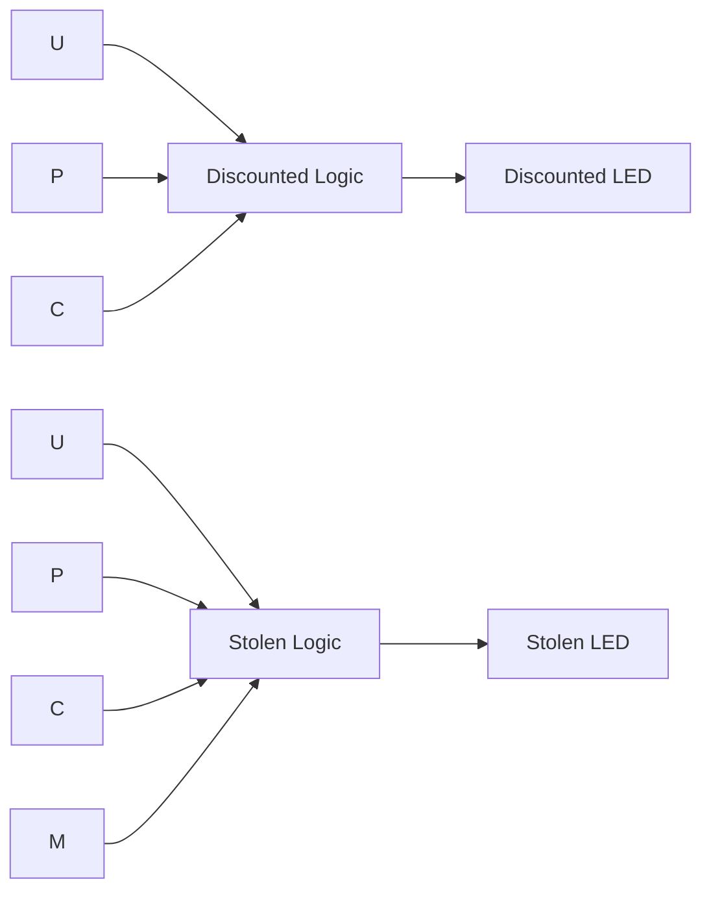

# 02.2 — UPC Feature Detector — Multi‑Level Logic (K‑Maps)

1. Overview

Detect discounted items by UPC and flag stolen items based on a secret mark policy.

2. Features

- Two outputs: `Discounted` (by UPC) and `Stolen` (expensive item returned without mark).
- Don’t‑care handling for unused UPC codes.
- Minimized equations using K‑Maps or Boolean algebra.

3. Block Diagram

4. Directory Structure

- `rtl/upc_detector.sv`: Discounted/Stolen logic.
- `DE1_SoC.sv`: Top‑level pin mapping.
- `sim/`: Testbench covering all input combinations.

5. Module Descriptions

- `upc_detector(U,P,C,M,discounted,stolen)`:
  - Encodes the truth‑table with minimized logic.

6. Interface Specification

- Inputs: `U,P,C` (UPC bits), `M` (mark, 1=present).
- Outputs: `discounted` (1 if item ever discounted), `stolen` (1 if expensive and unmarked).

7. Timing Diagrams

- Combinational response; LED outputs update after inputs settle.

8. Finite State Machine (FSM) Description

- Not applicable.

9. Parameterization

- Optional parameters to remap UPC codes or mark policy.

10. Reset Behavior

- Not applicable.

11. Clocking Requirements

- None.

12. Build / Simulation Instructions

- Simulate: sweep 16 combinations of `U,P,C,M`.
- Synthesize: program DE1‑SoC and verify with switches (`SW7=U, SW8=P, SW9=C, SW0=M`).

13. Testbench Architecture

- Stimulus: nested loops over `U,P,C,M`.
- Checks: compare against reference function table.

14. Verification Plan

- Validate discounted mapping for all defined UPCs.
- Validate stolen logic across the four policy cases.

15. Synthesis Notes

- Use don’t‑cares to reduce LUTs; prefer sum‑of‑products or factored forms as fits well.

16. Known Issues / Limitations

- Behavior for unused UPCs is don’t‑care.

17. License

- MIT.

18. Acknowledgments

- Course materials for EEP 535.

