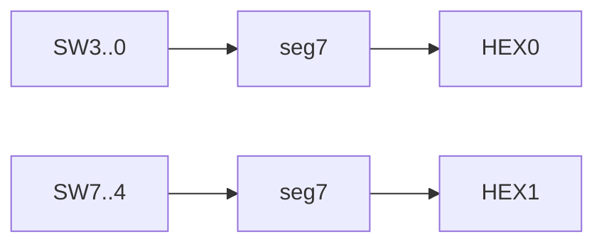

# 03.1 — Seven‑Segment Decoder — Combinational Display Encoder

1. Overview

Implement BCD‑to‑seven‑segment decoder (`seg7`) and display two digits using board switches.

2. Features

- `seg7` decodes 0–9 to segments `gfedcba`.
- Two instances: `SW[3:0]→HEX0`, `SW[7:4]→HEX1`.
- Don’t‑care default for non‑decimal inputs.

3. Block Diagram

4. Directory Structure

- `rtl/seg7.sv`: Decoder implementation.
- `DE1_SoC.sv`: Top‑level instantiating two `seg7` blocks.
- `sim/`: Simple testbench.

5. Module Descriptions

- `seg7(bcd[3:0], leds[6:0])`: Maps BCD to segments.

6. Interface Specification

- `bcd[3:0]`: 4‑bit input digit.
- `leds[6:0]`: 7‑bit output segments (1=on), order `gfedcba`.

7. Timing Diagrams

- Combinational; segments update immediately after input changes.

8. Finite State Machine (FSM) Description

- Not applicable.

9. Parameterization

- Fixed 7‑segment mapping; extendable for A–F if desired.

10. Reset Behavior

- Not applicable; top may clear HEX by default assignment.

11. Clocking Requirements

- None.

12. Build / Simulation Instructions

- ModelSim: iterate `bcd=0..15` and capture waveforms.
- Quartus: compile and test on board.

13. Testbench Architecture

- Stimulus: drive all 16 input values.
- Optional self‑check against a lookup table.

14. Verification Plan

- Confirm 0–9 patterns match expected; record outputs for don’t‑care inputs.

15. Synthesis Notes

- Encoded `case` with `default: 'bx` allows optimization.

16. Known Issues / Limitations

- Only decimal digits 0–9 implemented by default.

17. License

- MIT.

18. Acknowledgments

- Course materials for EEP 535.

