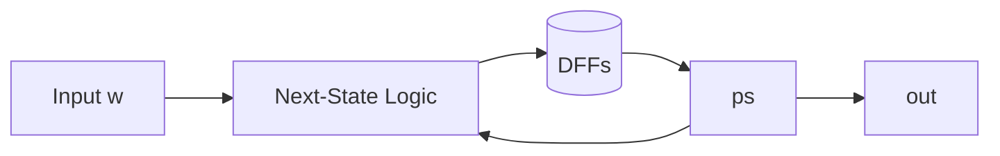

# 01.1 - Sequential FSMs: Mealy Detector (DE1-SoC)

1. Overview

Implement and simulate a simple Mealy‑type sequence detector and integrate it on DE1‑SoC for visualization.

2. Features

- Three‑state Mealy FSM: `{none, got_one, got_two}`.
- Output `out` asserted when in `got_two`.
- Board top with selectable simulation or divided clock (if desired).

3. Block Diagram

4. Directory Structure

- `simple.sv` — FSM RTL.
- `DE1_SoC.sv` — Board I/O, optional clock divider, signal routing.
- `simple_testbench.sv` — TB with clock/reset and input sequence.

5. Module Descriptions

- `simple(clk, reset, w, out)` — Mealy FSM with three states and boolean output.
- `DE1_SoC(...)` — Instantiates `simple` and exposes signals on LEDs.

6. Interface Specification

- `simple`
  - `input  logic clk, reset, w`
  - `output logic out` — high in state `got_two`.

7. Timing Diagrams

- Show `clk`, `reset`, `w`, `ps/ns`, and `out` across a few cycles to verify transitions.

8. Finite State Machine (FSM) Description

- States: `none` → `got_one` → `got_two`; with self/rollback on `w` per lab spec.
- Output: combinational function of current state.

9. Parameterization

- None required; state encodings are tool‑chosen.

10. Reset Behavior

- Synchronous reset: `ps <= none` on reset.

11. Clocking Requirements

- `clk` at 50 MHz for simulation; optional divided clock for board demo.

12. Build / Simulation Instructions

- ModelSim: compile `simple.sv` + TB; run; inspect waveforms.
- Quartus+ModelSim: integrate in `DE1_SoC.sv`; simulate top; then program board.

13. Testbench Architecture

- Clock generator (`forever #(PERIOD/2)`), reset pulse, scripted `w` changes.
- Optional self‑check using expected state progression.

14. Verification Plan

- Exercise transitions for `w=0/1` sequences; verify `out` only in `got_two`.

15. Synthesis Notes

- FSM encodings auto‑selected; ensure one `always_ff` and one `always_comb` partitioning.

16. Known Issues / Limitations

- None beyond I/O mapping differences across boards.

17. License

- MIT.

18. Acknowledgments

- EEP 535 course materials.

