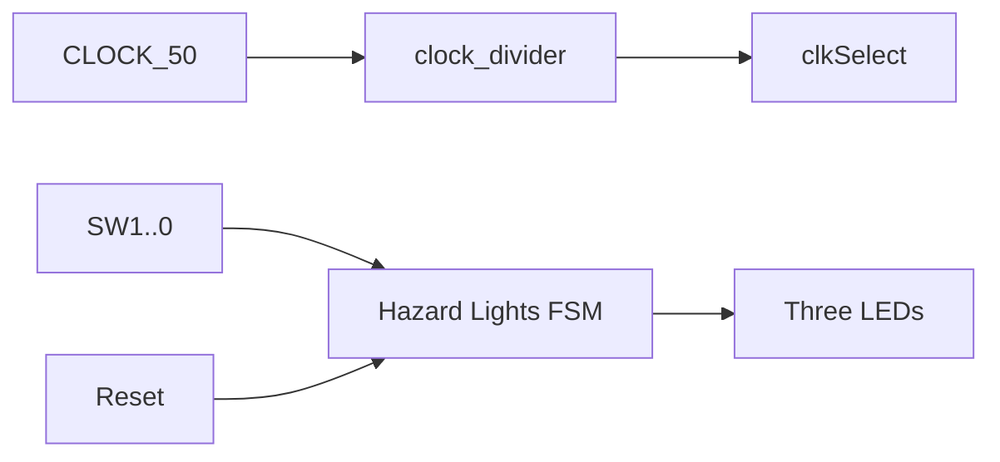

# 01.1 — Hazard Lights LED Sequencer (DE1‑SoC)

1. Overview

Build a clocked LED sequencer that indicates wind direction (left, right, calm) with a reset input, running at a human‑visible rate.

2. Features

- Clock divider to slow `CLOCK_50` to sub‑Hz for board demo.
- FSM‑driven patterns for calm and crosswind directions.
- Synchronous reset via `KEY[0]` (active‑low on board, map to active‑high in RTL).

3. Block Diagram

4. Directory Structure

- `hazard_lights.sv` — Main FSM.
- `clock_divider.sv` — 32‑bit divided clocks generator.
- `DE1_SoC.sv` — Top‑level integration for board.
- `*_testbench.sv` — Simulation top and TB wave scripts.

5. Module Descriptions

- `clock_divider(clock, reset, divided_clocks)` — free‑running counter; taps expose divided clocks.
- `hazard_lights(clk, reset, sw[1:0], leds[2:0])` — outputs time‑sequenced patterns by mode.
- `DE1_SoC(...)` — ties switches/keys to FSM and displays.

6. Interface Specification

- `clock_divider`: `clock` (in 50 MHz), `reset` (in), `divided_clocks[31:0]` (out).
- `hazard_lights`: `clk` (in), `reset` (in), `sw[1:0]` (in: calm/left/right), `leds[2:0]` (out).

7. Timing Diagrams

- Show `clkSelect` vs. `leds` cycling for each mode; include reset behavior.

8. Finite State Machine (FSM) Description

- Small cycles per mode: e.g., Left: `100→010→001→...`; Right reversed; Calm alternates `101↔010`.

9. Parameterization

- `whichClock` index for divider selection; optional pattern hold time params.

10. Reset Behavior

- Synchronous reset to a known starting pattern per mode.

11. Clocking Requirements

- Simulation: consider `CLOCK_50` directly; Board: `divided_clocks[whichClock]` (e.g., 25 → ~0.75 Hz).

12. Build / Simulation Instructions

- ModelSim: simulate `DE1_SoC_testbench`; verify patterns.
- Quartus: compile, assign pins, program DE1‑SoC.

13. Testbench Architecture

- Stimulus: toggle modes and reset; run for multiple visual cycles.
- Checks: assert expected pattern sequences.

14. Verification Plan

- Cover each mode’s full cycle; verify reset from arbitrary phase lands in start state.

15. Synthesis Notes

- Subtract divider resources when reporting FSM size.

16. Known Issues / Limitations

- Button polarity and debouncing handled at top‑level; FSM assumes clean signals.

17. License

- MIT.

18. Acknowledgments

- EEP 535 course materials.

