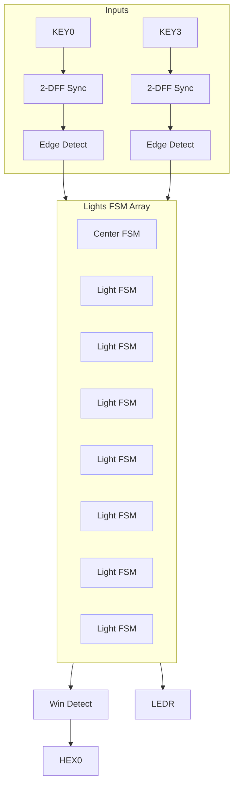

# 02 — Communicating Sequential Logic: Tug‑of‑War with Synchronizers

1. Overview

Implement a 2‑player Tug‑of‑War game across `LEDR9..LEDR1` using modular communicating FSMs, synchronized button inputs, and edge detection. Winner is shown on `HEX0`.

2. Features

- Modular light FSMs (1 center + 8 normal) instead of a monolithic state machine.
- Two‑DFF input synchronizers for metastability mitigation.
- One‑pulse per press via edge detection; direct 50 MHz operation.

3. Block Diagram

4. Directory Structure

- `rtl/centerLight.sv`, `rtl/normalLight.sv` — light FSMs.
- `rtl/sync_2ff.sv`, `rtl/edge_detect.sv` — input conditioning.
- `rtl/win_detect.sv` — determines winner and drives `HEX0`.
- `DE1_SoC.sv` — Top‑level wiring.
- `sim/` — Unit TBs + top TB.

5. Module Descriptions

- `centerLight(...)` — initializes lit center; moves based on edges and neighbor lights.
- `normalLight(...)` — moves on neighbor handoff and button edges.
- `sync_2ff(clk,d,q)` — two‑flop synchronizer.
- `edge_detect(clk,din,rise)` — one‑cycle pulse on rising edge.
- `win_detect(...)` — asserts win when light exits array; updates 7‑seg display.

6. Interface Specification

- Light FSMs:
  - `input  logic clk, reset, L, R, NL, NR`
  - `output logic lightOn`
  - `L/R` are edge pulses; `NL/NR` indicate neighbor lit.

7. Timing Diagrams

- Show button press → sync → one‑pulse edge → single step of light.

8. Finite State Machine (FSM) Description

- Each light FSM ≤4 states, e.g., `{OFF, ON, TAKE_LEFT, TAKE_RIGHT}`.

9. Parameterization

- Optional vectorization of light array length; index of center position.

10. Reset Behavior

- Synchronous reset: center lit, others off; winner cleared.

11. Clocking Requirements

- Use `CLOCK_50` directly for entire design.

12. Build / Simulation Instructions

- Simulate unit FSMs, input path, and top integration.
- Program board; verify one step per press and winner display.

13. Testbench Architecture

- Unit TBs: directed sequences for each FSM.
- Top TB: alternating edges to force left/right moves and wins.

14. Verification Plan

- No motion without edges; exactly one motion per press; correct winner detection.

15. Synthesis Notes

- Ensure signals cross only via synchronized/edge‑detected paths.

16. Known Issues / Limitations

- No explicit debounce; assumes edges are clean post‑sync.

17. License

- MIT.

18. Acknowledgments

- EEP 535 course materials.

