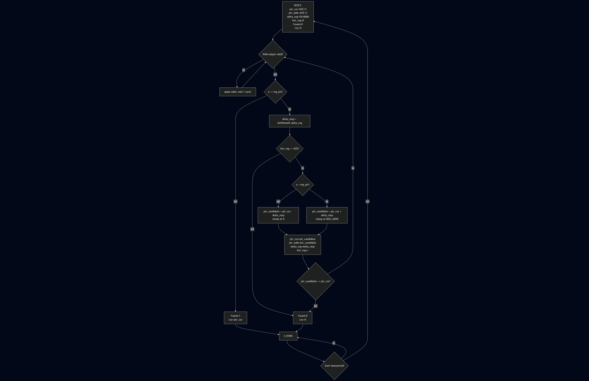

# 02.2 - Register Lookup Through Binary Search

[

Overview
- Implement a binary-search based register lookup using an ASM/ASMD approach with on-chip memory.
- Read a sorted table from RAM, compare against a target key, and report match/fail over HEX/LED outputs.

Contents
- `quartus/`: Project implementing the binary search controller and datapath.
- `constraints/`: Pin assignments for addresses, data, control inputs, and displays.
- `lab3.txt`: Full lab handout and requirements.

How to run
- Compile the Quartus project and program the DE1-SoC.
- Load or preset the memory contents as specified; set the search key via switches.
- Start the search per the handout controls; observe HEX/LEDs for address probes and final result.

What to verify
- Search probes midpoints correctly and narrows the range each step.
- Success flag asserts on a found key; failure sets the not-found indication after bounds cross.
